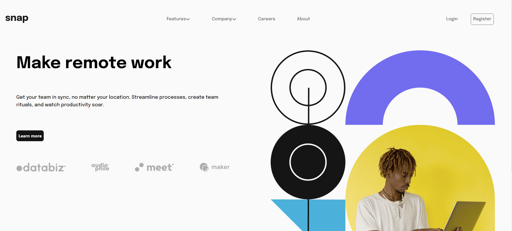
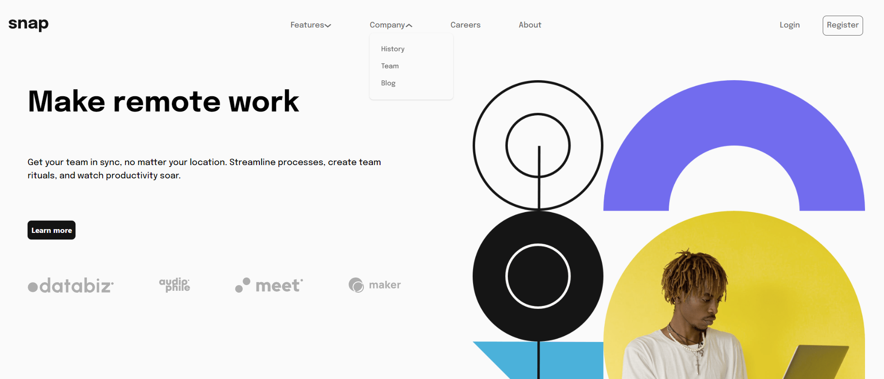
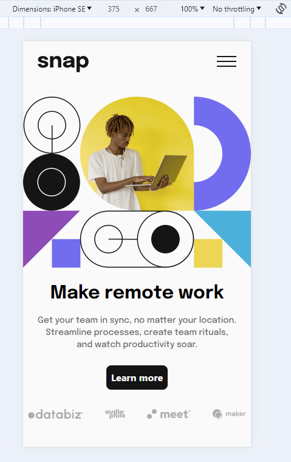
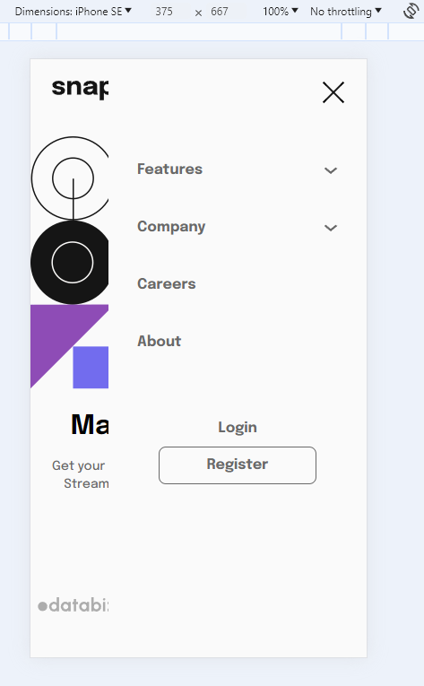
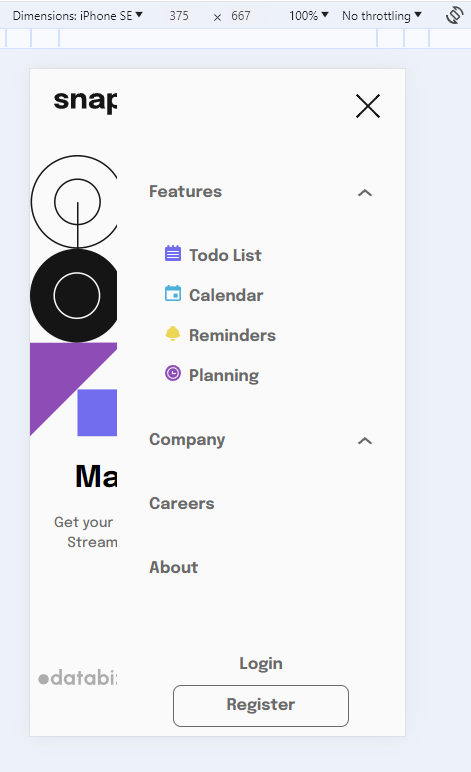
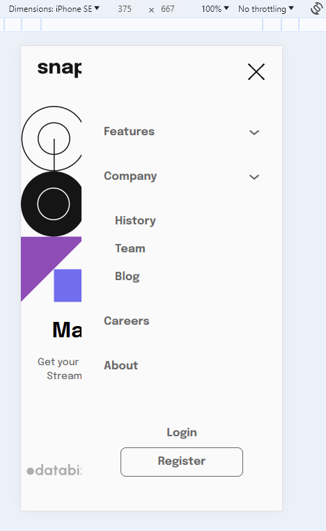

# Intro section with dropdown navigation solution

This project was aimed at learning about introductory website layout and dropdown menus. This is a solution to the [Intro section with dropdown navigation challenge on Frontend Mentor](https://www.frontendmentor.io/challenges/intro-section-with-dropdown-navigation-ryaPetHE5). Frontend Mentor challenges help you improve your coding skills by building realistic projects. 

## Table of contents

- [Overview](#overview)
  - [The challenge](#the-challenge)
  - [Screenshot](#screenshot)
  - [Links](#links)
- [My process](#my-process)
  - [Built with](#built-with)
  - [What I learned](#what-i-learned)
  - [Continued development](#continued-development)
  - [Useful resources](#useful-resources)
- [Author](#author)

## Overview

This project was an exercise in creating an introductory web page featuring a dropdown menu that adapts to both desktop and mobile interfaces. The challenge was to implement hover states for all interactive elements, ensuring a seamless user experience across different devices. Key skills applied in this project included the use of flexbox for layout management, TailwindCSS for styling, and ReactJS for dynamic state management. The project aimed to refine my understanding of responsive design, emphasizing desktop and mobile compatibility.

### Screenshot

Desktop View:

Desktop Features Dropdown View:

Desktop Company Dropdown View:

Mobile View:

Mobile Sidebar Navigation View:

Mobile Sidebar Navigation Features Dropdown View:

Mobile Sidebar Navigation Company Dropdown View:

### Links

- Solution URL: [Add solution URL here](https://your-solution-url.com)
- Live Site URL: [Netlify Deployed Website](https://thunderous-biscotti-67daf5.netlify.app/)

## My process

The journey of this project began with the initial setup, which included creating a GitHub repository, initializing a Vite project with ReactJS, and integrating TailwindCSS. I configured TailwindCSS to incorporate the project's design specifications, such as fonts and colors. After ensuring the foundational elements were operational through an initial commit, I proceeded to remove the default ReactJS template content to start with a clean slate.

My approach to tackling the project was methodical. I started by analyzing the provided design layout and style guide, utilizing Microsoft Paint to sketch a roadmap for the development process. This preliminary planning phase helped me strategize the implementation of key features, including hover states, a mobile-responsive layout, and dropdown menus. The decision to prioritize the mobile layout and sidebar navigation set the stage for a structured development process.

The construction of the mobile layout was the first milestone, where I focused on replicating the design's key elements: positioning the logo, adding a hamburger menu icon, centering an image, and arranging the textual content and interactive elements at the bottom. This phase laid a solid foundation for the mobile user experience.

Next, I tackled the sidebar navigation, which proved to be a challenging yet rewarding endeavor. Implementing the sidebar required a deeper dive into React's useState hooks for dynamic content display, alongside mastering TailwindCSS for styling. The development of an animated sidebar, triggered by the hamburger icon, involved careful consideration of text styling and the integration of dropdown functionality. This phase was instrumental in enhancing my understanding of state management and UI interactivity.

Transitioning to the desktop layout, I aimed to maintain consistency with the mobile version while accommodating the nuances of a larger viewport. Utilizing a grid container for the main content and flexbox for the navigation bar, I navigated through the complexities of responsive design and dropdown menu styling. This stage was particularly enlightening, as it deepened my knowledge of CSS positioning and flexbox.

The final touches to the project involved refining hover states and ensuring compliance with the design requirements. The adjustment of media queries ensured a seamless transition between different device sizes. Deploying the project on Netlify was the culmination of my efforts, providing a live website of my work.

Reflecting on the project, I am very satisfied with the outcome and the growth I experienced throughout the process. The project not only solidified my skills in responsive design and React development but also instilled a deeper appreciation for the intricacies of web development.

### Built with

- Mobile-first workflow
- [React](https://reactjs.org/) - JS library
- Vite
- Tailwind CSS
- Semantic HTML5 markup
- CSS custom properties

### What I learned

1. Throughout this project, my proficiency in utilizing TailwindCSS for custom styling significantly improved. I learned more about extending Tailwind's default theme to include project-specific colors, font sizes, and fonts. This was crucial for aligning the website's design with the predefined style guide. An example of this customization involved adding unique color schemes, adjusting font sizes for readability, and incorporating a custom font family, 'Epilogue', directly into Tailwind's configuration. Here's how I extended the theme in Tailwind's configuration file:

`
module.exports = {
  purge: ['./index.html', './src/**/*.{js,jsx,ts,tsx}'],
  darkMode: false, // or 'media' or 'class'
  theme: {
    extend: {
      colors: {
        'almost-white': 'hsl(0,0%,98%)',
        'almost-black': 'hsl(0,0%,8%)',
        'medium-gray': 'hsl(0,0%,41%)',
      },
      fontSize: {
        'paragraph': '18px',
      },
      fontFamily: {
        'epilogue': ['Epilogue', 'sans-serif'], // Add this line
      },
    },
  },
  variants: {
    extend: {},
  },
  plugins: [],
};

  `

2. **Extending Background Color with Tailwind CSS**: To ensure the background color stretches to the bottom of the page, I applied the `min-h-screen` class to the main `
` in the App component. This approach guarantees that the `
` covers at least the full height of the viewport, allowing the background color to fill the entire visible area, independent of content height.

3. **Implementing Sidebar Navigation**: Developing the sidebar navigation was a significant learning experience. I utilized React's `useState` to manage the sidebar's visibility, toggling between open and closed states upon interacting with the hamburger icon. For the mobile version, I positioned the hamburger icon at the top right, ensuring it animates in response to changes in width.

4. **Dropdown Menu for Mobile Layout**: For the Features section, I crafted a dropdown menu, managing its visibility through state control and an `onClick` event handler. TailwindCSS styling was essential, ensuring the dropdown was both visually appealing and functional.

5. **Responsive Design with Media Queries**: My understanding of media queries grew, particularly in making the navigation sidebar responsive. By assigning specific class names to the mobile layout and using media queries, I successfully hid the sidebar on desktop screens, applying similar strategies for mobile visibility.

6. **Understanding `` Tags**: I discovered that `` tags are void elements, meaning they cannot contain child elements and only accept attributes. This realization came while debugging an issue related to this constraint.

7. **Grid Layout with TailwindCSS**: I implemented a two-part grid container using ReactJS for the desktop layout, positioning the image and text content effectively. This structure was pivotal in achieving a balanced and engaging layout.

8. **Flexbox Fundamentals**: My project experience enriched my understanding of flexbox, from basic flex properties to more complex configurations like `flex-row` and `justify-between`. These insights were invaluable in optimizing the layout and alignment of website elements.

9. **Enhancing Interactivity with Hover States**: Adding hover states to buttons and text elements was my final task, where I leveraged TailwindCSS for animation and color transitions. This enhancement significantly improved the user interface, making interactive elements more engaging.

### Continued development

I will continue to work on flexbox styling, TailwindCSS styling and learning more about dropdown menus. I will do this by working through Frontend Mentor challenges, my own projects and constantly learning.

### Useful resources

Resources I used to help build my project or reference:

- [Google Font Epilogue](https://fonts.google.com/specimen/Epilogue) - Google Font Epilogue from Google Fonts.
- [Navigation Sidebar](https://flowbite.com/docs/components/sidebar/) 
- [useState Hooks](https://hygraph.com/blog/usestate-react)
- [Conditional Styling](https://owlcation.com/stem/conditional-styling-react)
- [TailwindCSS Dropdown] (https://flowbite.com/docs/components/dropdowns/)

## Author

- Website - [Laura V](www.lauradeveloper.com)
- Frontend Mentor - [@lavollmer](https://www.frontendmentor.io/profile/yourusername)
- Github - [@lavollmer](https://github.com/lavollmer)

